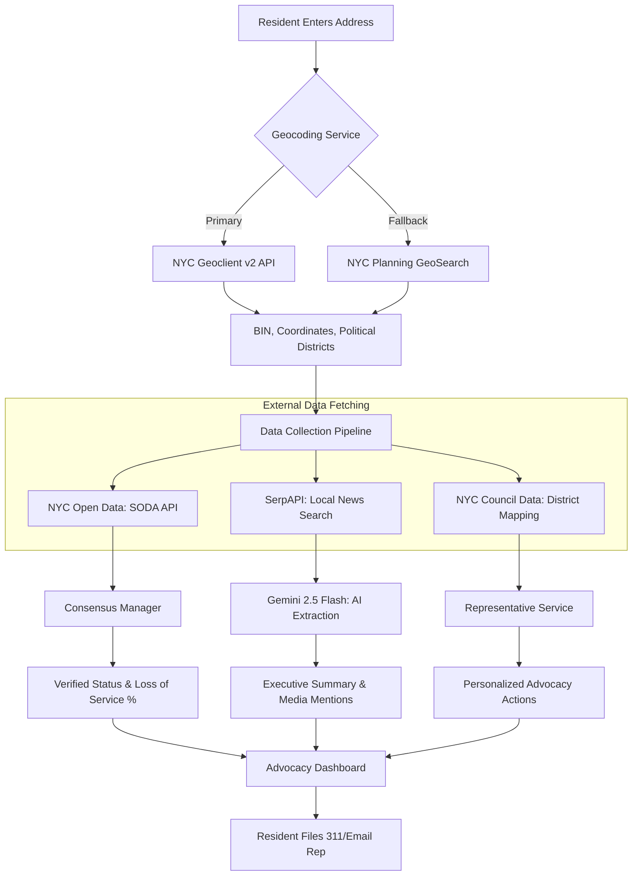

# NYC Tenant Elevator Advocacy Platform

I am building this platform to empower NYC tenants with the data and tools they need to address elevator mismanagement. By cross-referencing real-time tenant reports with official NYC Department of Buildings (DOB) records, I provide a clear, quantified view of building maintenance performance and a guided workflow for advocacy.

## Core Mission
I aim to close the information gap between residents and property owners. This tool provides:
- **Verified Transparency**: Tenant reports require multi-user consensus within a specific time window to ensure data integrity.
- **Quantified Advocacy**: I calculate a "Loss of Service" metric to help tenants present hard data in housing court or to the media.
- **Automated Intelligence**: A custom multi-agent system analyzes building history and suggests specific legal or community organizing steps.

## Tech Stack
I selected these technologies to ensure a decoupled, performant, and type-safe environment:
- **Backend**: Django 6.0, Django REST Framework, PostgreSQL.
- **Frontend**: React 19, TypeScript, Vite, Tailwind CSS.
- **Package Management**: `uv` for Python, `npm` for JavaScript.
- **Orchestration**: Custom Python-based multi-agent system.

## Getting Started

### Prerequisites
- Python 3.12+ 
- `uv` (Installed via `curl -LsSf https://astral.sh/uv/install.sh`)
- Node.js 20+

### Backend Setup
1. Navigate to the backend directory: `cd backend`
2. Create and sync the environment: `uv sync`
3. Set up your environment variables: `cp .env.example .env` (Add your NYC Open Data and Geoclient keys).
4. Run migrations: `uv run python manage.py migrate`
5. Start the server: `uv run python manage.py runserver`

### Frontend Setup
1. Navigate to the frontend directory: `cd frontend`
2. Install dependencies: `npm install`
3. Start the development server: `npm run dev`
4. Run E2E tests: `npm run test:e2e`

## Core Domain Logic
- **The 2-Hour Consensus Rule**: An elevator outage is only marked as "Verified" once two different users report the same status within a rolling 2-hour window.
- **SODA Pipeline**: I query the NYC Open Data Socrata API for category 81 (Elevator Danger/Inoperative) and category 63 (Failed Test) complaints.
- **Agentic Analysis**: I use a Supervisor-Worker pattern to analyze data. The "Advocacy Strategist" agent maps building violations against NYC housing laws to provide specific "Next Step" workflows.

## Architecture & API Workflow
The platform acts as a **synthesis engine**, correlating disparate official data sources with real-time resident observations to produce a quantified "Loss of Service" metric. 

### The Data Synthesis Engine
1.  **Identity Resolution**: I first resolve a street address into a unique Building Identification Number (BIN) and capture political district IDs. This ensures all subsequent data is pinned to the correct physical structure.
2.  **Multimodal Collection**: I pull official complaint history from the **SODA API** and perform a targeted local news search via **SerpAPI**.
3.  **AI Orchestration**: I use **Gemini 2.5 Flash** as a "Reasoning Layer" to extract structured facts from unstructured news snippets and to generate the "Advocacy Strategist" scripts tailored to the building's specific legal standing.
4.  **Actionable Output**: The resident receives a unified dashboard that converts raw data into high-impact tools, such as the "Email Representative" button that automatically includes the building's calculated "Loss of Service" stats.

## Development Standards
I maintain high professional standards for this codebase:
- **Full Type-Hints**: Every Python function requires `mypy` coverage.
- **Documentation**: I use Google-style docstrings for all services and models.
- **UI/UX**: I use intentional empty states and visual pulsing for unverified data. No raw 0s are displayed for empty datasets.

For detailed developer instructions, please refer to [GEMINI.md](./GEMINI.md) and [project_spec.md](./project_spec.md).