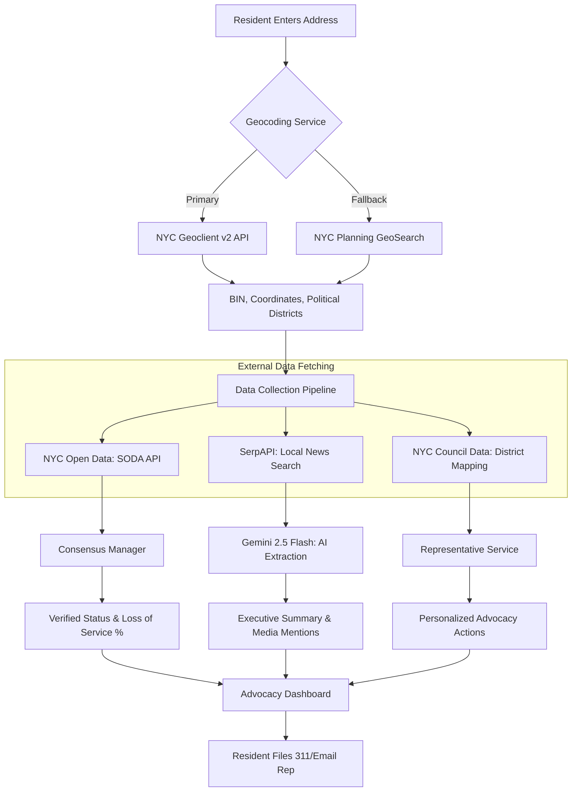

# Elevator Advocate
## NYC Tenant Elevator Advocacy Platform · "Dignity Through Data"

Hi, I’m **Karl Johnson**, a resident of District 17 in the Bronx. I am building this platform as a gift of service to my community—born from the daily reality of watching my neighbors, many of whom are seniors or rely on wheelchairs, rendered immobile and oppressed by failing elevators.

In my building, a broken elevator is more than a maintenance delay—it's a crisis that strips people of their mobility and dignity. I’ve seen neighbors trapped on their floors for weeks at a time. This project, started during my AI-Native fellowship at **Pursuit**, is my response. We are turning these daily frustrations into the hard data needed for collective advocacy and survival.

## ✊ The Mission
The goal is simple: **Close the information gap between residents and property owners.** 

Currently, the city's 311 system is slow, and official NYC Open Data (SODA) often lags behind reality. This platform helps residents by providing:

- **Real-time Verification**: Outages are "Verified" only when multiple residents report them within two hours, creating a record that landlords can't ignore.
- **Service Metrics**: We calculate a **"Loss of Service" (LoS) %**—turning downtime into the kind of data used in Housing Court or legislative briefings.
- **Direct Advocacy**: We map buildings to NYC Council Districts and provide residents with AI-powered 311 scripts and direct email links to their representatives.
- **Support Networks**: Status updates help family members and care providers know if their loved ones can actually get in and out of their building.

### 🥀 The Stakes: Why This Matters
Accessibility is a life-safety issue. Recent data and reporting from early 2026 reveal the lethal cost of the status quo:
- **Lethal Isolation**: In 2025, a Bronx resident passed away during a heat wave because they were physically unable to leave their 4th-floor apartment during an extended elevator outage.
- **Seniors "Imprisoned"**: At Surfside Gardens in Coney Island, seniors like Aleksandra (79) and Valeriy (85) reported 47 outages in a single year, missing critical medical appointments and being unable to access food.
- **The Month-Long Outage**: In Queens, a 100-year-old resident was trapped in her home for over 30 days due to management's failure to perform repairs.

**Data is the only way to prove these aren't "isolated incidents."**

---

## 🛠️ How It Works: The Data Synthesis Engine
The platform acts as a reasoning layer that correlates real-time tenant observations with official city records.



### Core Logic
1.  **The 2-Hour Consensus Rule**: To cut through the noise, an outage is "Verified" only after two different residents report it within a two-hour window.
2.  **Identity Resolution**: We link every report to a specific physical building (using its Building Identification Number) so our data holds up in court or a council meeting.
3.  **Agentic Analysis**: We use a supervisor-worker pattern (Gemini 2.5 Flash) to cross-reference building history with NYC housing law and suggest specific legal or organizing steps.

---

## ♿ Accessibility & Inclusive Design: The "Martha-First" Protocol
Accessibility isn't a checklist—it's the reason this exists. To make sure the platform works for the seniors and residents with mobility impairments who need it most, we design for **"Martha."** She is a 72-year-old neighbor with limited mobility who uses a walker and an older smartphone. If it doesn't work for her, it doesn't work at all.

- **Martha-First UX**: We prioritize high-contrast text, large touch targets, and full screen-reader support (WCAG 2.2).
- **Plain-Language Alerts**: We translate technical data like "SODA API Lags" into clear status blocks (e.g., *"Elevator is NOT WORKING. 3 neighbors have confirmed this."*).
- **Stable Performance**: We use React 19 features like `useOptimistic()` and `Suspense` so the app stays fast and responsive even on slow mobile networks.
- **Automated Testing**: Our CI/CD pipeline runs **"Martha's Journey"**—a specialized test suite that uses **Playwright + Axe-Core** to verify that critical paths like reporting an outage are fully accessible.
- **Spanish Internationalization**: A significant portion of residents in District 17 speak Spanish at home. We are providing full Spanish localization to ensure that every neighbor can use these tools with dignity. We are currently seeking qualified volunteers or consultants to audit our translations for idiomatic accuracy and technical clarity.

---

## 🏛️ The Systemic Data Gap: A Barrier to Justice
Accessibility isn't just about screen readers and high contrast; it’s about **access to the truth.** In NYC, the data that should protect tenants is often locked behind the same kind of bureaucratic gatekeeping that keeps an elevator broken for months.

- **The "API Rite of Passage"**: Even in 2026, a developer building a tool for their community must wait days for a "Geoclient" API key to be manually approved. This is a digital mirror of the slow-walked "DOB Inquiry" that tenants face. While the MTA processes OMNY swipes in milliseconds, our city's residential infrastructure data still moves at the speed of a paper filing.
- **The Real-Time Myth**: The NYC Open Data (SODA) API is a vital resource, but it is nowhere near real-time. This lag means that by the time an official complaint shows up in a city database, a senior has already been trapped on the 10th floor for 48 hours. 
- **Our Response**: We don't wait for the city to catch up. By using **NYC Planning GeoSearch fallbacks** and our **2-Hour Consensus Engine**, we create our own source of truth. We believe that in an age of instant data, there is no excuse for residential elevators not to have transparent, actionable, and immediate data reporting for the public.

---

## 📊 Data Research & Insights
The project includes a suite of standalone scripts and Jupyter notebooks used to generate the "Dignity Through Data" narratives. These allow for rapid exploration of NYC elevator complaint data (2018–2026) without requiring a full Django environment.

### 🐍 Standalone Scripts
Located in `scripts/data_research/`, these Python scripts provide high-signal output for briefings and demos.

| Script | Narrative |
|---|---|
| `city_overview.py` | The Scale of the Problem (City-wide leaderboards & borough stats) |
| `seasonal_trends.py` | The Summer Spike (33% jump in July complaints since 2018) |
| `district_hotspots.py` | Worst Buildings Per District (Targeted lists for Councilmembers) |
| `building_timeline.py` | One Building's Full Story (Long-term patterns of failure) |

**Sample Output (`city_overview.py`):**
```text
  NYC ELEVATOR COMPLAINTS — CITY-WIDE OVERVIEW
  Years: 2024 | Codes: 6S, 6M | Source: NYC Open Data
  --------------------------------------------------------------
  Total complaints in period: 12,565

  COMPLAINTS BY BOROUGH
  Bronx              4,010  (31.9%)  ████████████████████████████
  Brooklyn           3,313  (26.4%)  ███████████████████████
  Manhattan          3,171  (25.2%)  ██████████████████████
  Queens             1,922  (15.3%)  █████████████
  Staten Island        148  ( 1.2%)  █
```

### 📓 Jupyter Notebooks
For presentation-ready visuals (matplotlib) and interactive filtering, visit `scripts/data_research/notebooks/`.

**Setup:**
```bash
cd scripts/data_research
pip install -r requirements.txt
jupyter lab
```

---

## 💻 Tech Stack
I chose these tools to keep the platform fast, secure, and easy to maintain:

- **Backend**: Django 6.0, DRF, PostgreSQL.
- **Frontend**: React 19, TypeScript, Vite, Tailwind CSS.
- **Orchestration**: Custom Python multi-agent system (Gemini 2.5 Flash).
- **Package Management**: `uv` for fast, reproducible Python environments.
- **Standards**: Strict PEP-8 compliance via **Ruff** and full type-safety.

---

## 🚀 Getting Started

### Prerequisites
- Python 3.12+ 
- `uv` (Installed via `curl -LsSf https://astral.sh/uv/install.sh`)
- Node.js 20+

### Quick Setup
1. **Backend**:
   ```bash
   cd backend
   uv sync
   cp .env.example .env # Add your NYC Open Data & Gemini keys
   uv run python manage.py migrate
   uv run python manage.py runserver
   ```
2. **Frontend**:
   ```bash
   cd frontend
   npm install
   npm run dev
   ```
3. **Validation**:
   Run `./backend/scripts/pre_flight.sh` to ensure the full suite (Ruff + Mypy + Pytest) is passing.

---

## 📈 Strategic Path Forward
Our goal is to build a **Power Block** for tenants by turning personal stories into the kind of evidence that forces action:
- **Direct Briefings**: We provide Councilmembers with Loss of Service reports to trigger DOB inquiries.
- **Legal Weight**: We are working to ensure our data is admissible in court through partnerships like **Mobilization for Justice**.
- **Grassroots Organizing**: We align with groups like **CASA** to put data directly into the hands of tenant unions.

**Data is power.** When we move from anecdotes to evidence, we make sure landlords treat accessibility as a fundamental right, not a suggestion.

---
*For detailed architectural documentation, see [docs/spec.md](./docs/spec.md) and [GEMINI.md](./GEMINI.md).*
